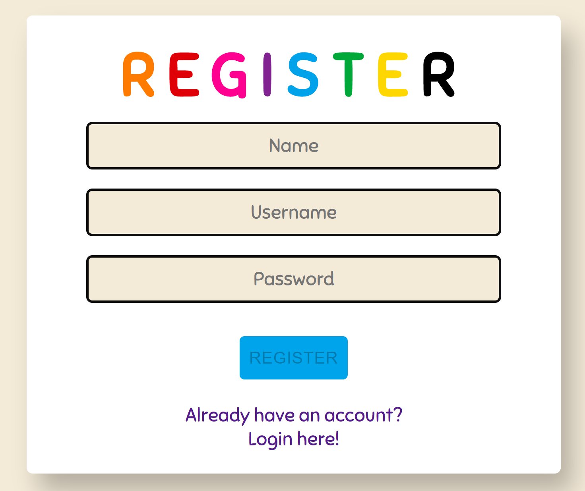

# SoPra FS20 - Group 03 - Client

## Introduction
This is the front-end part of the Board Game [Just One](https://justone-the-game.com/). It was built during the course 'SoPra'
at the University of Zurich.

## Technology stack
* [React JS](https://reactjs.org/) - User interface
* [Redux](https://redux.js.org/introduction/getting-started) - State management
* [MaterialUI](https://material-ui.com/) - UI Framework
* [npm](https://www.npmjs.com/) - Package management 
* [Axios](https://github.com/axios/axios) - HTTP Requests
* [Heroku](https://www.heroku.com/) - Deployment
* [SonarQube](https://www.sonarqube.org/) - Code Quality Control

##  Main Components

The app's entry point is in [Index.js](/src/index.js).

###  Registration/Login
The [Registration](/src/components/login/Register.js) and [Login](/src/components/login/Login.js) pages are the entry point for every user that opens the game. Users can create a new account
or login with existing credentials. This takes them to the lobby page.

### Lobby
The [Lobby](/src/components/lobby/Lobby.js) is where users can create and join games. It also lets users access their
profile page and view the game history. After creating a game users wait for other players to join their game until they can start it.
If they join a game they have to wait for the creator to start the game. This takes them to the gameplay component.

### Gameplay
The [Gameplay](/src/components/game/Gameplay.js) component is where the actual gameplay happens. It keeps track of the 
different game phases, tracks points, clues and guesses and displays the other gameplay components.


## Prerequisites and Installation

###Installation and Development

First, clone this repository to your machine by running:
```shell script
$ git clone https://github.com/Sopra20-03/project-client.git
```

For your local development environment you'll need Node.js >= 8.10. You can download it [here](https://nodejs.org). All other dependencies including React get installed with:

```shell script
$ npm install
```
This has to be done before starting the application for the first time (only once).

```shell script
$ npm run dev
```

Runs the app in the development mode.<br>
Open [http://localhost:3000](http://localhost:3000) to view it in the browser.

The page will reload if you make edits.<br>
You will also see any lint errors in the console (use Google Chrome!).

In order for the application to run completely, also make sure you have an instance of the 
[backend](https://github.com/Sopra20-03/project-server) of the game running on your machine.

### Releases
To create a release, push a production-ready code base to the master branch and it will automatically deploy to 
[Heroku](https://sopra-fs20-group-03-client.herokuapp.com/).


## Illustrations

##### Register- / Loginscreen 



On the Registerscreen users can put in their user information and click the "register" button. This will create a new 
on the backend and take the user to the Loginscreen. On the Loginscreen users put in their credentials and click on the
login button. This will take them to the Lobbyscreen.

##### Lobbyscreen 


The lobbyscreen is the one of the main views of the game. From here players can do several things:
* Create a new game
* Start a created game
* Join a created game
* Go to the leaderboard page
* Go to the profile page
* View game instructions

Pressing the "Start Game" button takes the user to the gameplay views. 

##### Gameplay


This is the 


## Roadmap
Rodadasdfasd


## Authors and Acknowledgement


## License

>Check out the full licence [here](./LICENSE "MIT License")

We chose to license our project under the terms of the **MIT** license. 